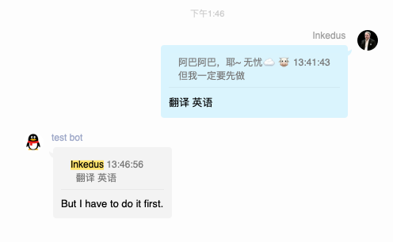

## 插件介绍
Zero是基于BotPro的娱乐群管插件
目前插件还在开发测试阶段
## 功能

括号里的指令代表可有可无

| 类型     | 指令           | 用法                                                         | 限制                     |
| -------- | -------------- | ------------------------------------------------------------ | ------------------------ |
| 单指令   | 全群禁言       | 全群禁言                                                     | 管理员、群主、机器人主人 |
| 单指令   | 全群解禁       | 全群解禁                                                     | 管理员、群主、机器人主人 |
| 单指令   | 渣男语录       | 渣男语录                                                     | 所有人可用               |
| 单指令   | 绿茶语录       | 绿茶语录                                                     | 所有人可用               |
| 单指令   | 舔狗语录       | 舔狗语录                                                     | 所有人可用               |
| 单指令   | 二次元图片     | 二次元图片                                                   | 所有人可用               |
|          |                |                                                              |                          |
| 多指令   | 发语音         | 发语音#内容                                                  | 所有人可用               |
| 多指令   | 网抑音乐       | 网抑音乐#音乐名                                              | 所有人可用               |
| 多指令   | ping           | ping#域名或ip                                                | 所有人可用               |
| 多指令   | 翻译           | 翻译#内容(#语言)                                             | 所有人可用               |
| 多指令   | P站好图        | P站好图#666或者稳                                            | 所有人可用               |
| 多指令   | 禁言           | 禁言#@张三#60#秒(秒、分钟、小时、天)"                        | 管理员、群主、机器人主人 |
| 多指令   | 踢             | 踢#@被踢的人(#拉黑)                                          | 管理员、群主、机器人主人 |
| 多指令   | 设置头衔       | 设置头衔#@张三#头衔内容#1#小时(秒,分钟,小时,天) `或者: 设置头衔#@张三#头衔内容#永久` | 管理员、群主、机器人主人 |
| 多指令   | 收录查询       | 收录查询#网站域名                                            | 所有人可用               |
| 多指令   | md5            | md5#内容                                                     | 所有人可用               |
| 多指令   | base64加密     | base64加密#内容                                              | 所有人可用               |
| 多指令   | base64解密     | base64解密#5YaF5a65                                          | 所有人可用               |
| 多指令   | 藏头诗         | 藏头诗#群主真牛逼                                            | 所有人可用               |
| 多指令   | 手机号价格评估 | 手机号价格评估#18888888888                                   | 所有人可用               |
| 多指令   | 哔哩哔哩av转bv | 哔哩哔哩av转bv#av333075235                                   | 所有人可用               |
| 多指令   | 哔哩哔哩bv转av | 哔哩哔哩bv转av#BV1sA411G7mb                                  | 所有人可用               |
| 多指令   | 摩斯电码       | 摩斯电码#hello                                               | 所有人可用               |
| 多指令   | 解摩斯电码     | 解摩斯电码#.... . .-.. .-.. ---                              | 所有人可用               |
| 多指令   | 备案查询       | 备案查询#域名                                                | 所有人可用               |
|          |                |                                                              |                          |
| 回复指令 | 举报           | 举报                                                         | 所有人可用               |
| 回复指令 | 翻译           | 翻译 中文                                                    | 所有人可用               |
|          |                |                                                              |                          |
| 记忆指令 | 秀图           | 秀图                                                         | 所有人可用               |
| 记忆指令 | 图片链接       | 图片链接                                                     | 所有人可用               |
| 记忆指令 | 路由追踪       | 路由追踪                                                     | 所有人可用               |

### 翻译支持的语言

中文、繁体中文、英语、日语、韩语、法语、西班牙语、意大利语、德语、土耳其语、俄语、泰语

### 回复指令怎么玩?

上图

### 记忆指令怎么玩?

上图

## 安装方法
下载源码后，到BotPro后台上传插件 

上传后打开BotPro插件目录 app/Plugins 

确保本插件目录名为 `zero`

然后cd到 zero目录下

执行: `composer install`